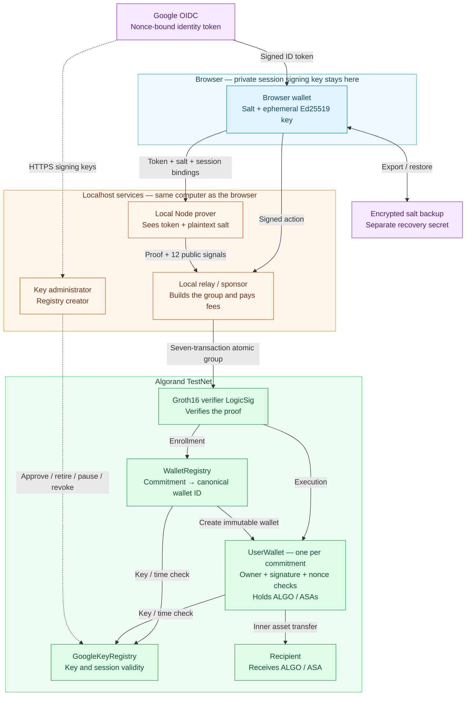

# AlgoZKAuth — zero-knowledge authorization on Algorand

AlgoZKAuth is a proof of concept that uses a Google login to authorize an independent Algorand application wallet. A zero-knowledge proof verifies the Google ID token and binds a temporary browser signing key to a salted identity commitment. The wallet checks that proof, current signing-key policy, the exact signed action and its replay nonce before transferring ALGO or Algorand Standard Assets (ASAs).

**The local desktop/TestNet scenario passed on 2026-10-09:** two genuine Google identities enrolled separate wallets and transferred ALGO/ASA; replay and cross-wallet authorization attempts were rejected. Restoring an encrypted backup after a Chrome reload recovered the original wallet, and a fresh Google session authorized further transfers. [Acceptance evidence](benchmarks/phase6-acceptance.testnet.json) records 11/11 checks across ten confirmed action groups. Physical second-device recovery and production readiness remain open.

## Architecture

The diagram shows the integrated TestNet demo. Solid arrows carry login, proof, action or recovery data; dashed arrows show signing-key administration. Each `UserWallet` is a separate application account for one salted identity commitment.



The verifier LogicSig signs the proof-carrying app call; proof verification and app execution occur in the same atomic group. The registry and wallet also check the configured audience/network and current key/session policy. The sponsor does not hold the browser's session key. The local prover **does see the token and salt**; only the proof and public signals go on-chain, alongside the signed action.

Restoration recovers the same salt and commitment, so registry discovery returns the original wallet; a new Google login creates a new session key. Secret restoration passed on the same Mac. Successful passkey PRF unlocking, other-browser and physical second-device recovery remain unverified.

## How it works

1. **Login and session binding.** The browser creates a nonextractable Ed25519 key. Google's signed nonce binds its public key, the Algorand network, randomness and a session expiry of at most ten minutes.
2. **Persistent identity.** A random 32-byte salt combines with the canonical Google issuer, OAuth audience and subject to produce the wallet's identity commitment. The salt survives session renewal through an encrypted backup.
3. **Proof generation.** A Circom circuit verifies the RS256 token and identity/session bindings. Groth16 over BN254 produces twelve public signals. The integrated demo sends the token and plaintext salt to a **localhost Node prover**; the browser retains its private session key.
4. **Enrollment and authorization.** A shared verifier LogicSig participates in a seven-transaction atomic group. `WalletRegistry` creates one immutable `UserWallet` application per commitment. The wallet independently checks the proof, `GoogleKeyRegistry` policy, signed action fields and nonce.
5. **Backup and restoration.** The browser encrypts the salt with AES-256-GCM and a generated recovery secret, with optional passkey PRF unlocking. The interface requires export/import and successful secret restoration before proving/enrollment. Restoration recomputes the original commitment and discovers the existing wallet.

Registry uniqueness applies to the **salted commitment**, not globally to a Google account. Generating a different salt creates a different identity and wallet. Google login alone cannot recover a lost salt.

## What the POC proved

| Capability | Recorded result | Evidence |
| --- | --- | --- |
| Algorand Groth16 verification | Custom proofs verified independently and confirmed on LocalNet; a seven-signal synthetic proof also confirmed on TestNet | [Verifier benchmarks](docs/verifier-feasibility.md) |
| Full Google JWT proof | Genuine Google token verified through the twelve-signal circuit and TestNet authorization path | [Protocol and evidence](docs/phase3-protocol.md) |
| Independent asset wallets | Two synthetic identities passed 46 LocalNet wallet checks, including signed-field changes, replay, isolation, rollback and session boundaries | [Wallet specification](docs/phase4-wallets.md) |
| Integrated Google wallets | Two genuine Google identities enrolled wallets `773944646` and `773945687`, transferred ALGO/ASA and passed recorded node rejection checks | [TestNet POC report](docs/poc-report.md) |
| Original-wallet recovery and renewal | Account A secret-restored its backup after Chrome reload; its original wallet accepted transfers under a fresh session key | [Integrated acceptance](benchmarks/phase6-acceptance.testnet.json) |
| Recovery after deleting original client state | A separate Node process restored the same salt and LocalNet wallet and confirmed a transfer using a fresh synthetic JWT | [Recovery evidence](docs/phase5-recovery.md) |
| Desktop browser proving | Chrome 154 generated a full-circuit proof with a **synthetic token**, single-threaded, in 423.688 seconds; the server independently verified it | [Browser benchmark](benchmarks/phase3-browser.json) |

The acceptance checker retrieves historical TestNet blocks and verifies exact transaction IDs, complete groups, deployed wallet/registry code and policy, proof bytes, Ed25519 action signatures, transfers, fees and current wallet state. Rejected transactions have no confirmed block record: replay/isolation results rely on sanitized local records of actual node rejection. Google identity labels also rely on the local login verifier. These evidence boundaries are detailed in [the POC report](docs/poc-report.md).

## Measured costs

| Measurement | Result |
| --- | --- |
| Full JWT circuit | 2,726,377 constraints; twelve public signals |
| Development proving key | 1,425,797,992 bytes (1.426 GB / 1.328 GiB) |
| Four integrated genuine Google proofs | 124.751–130.697 seconds; 1,705–2,213 MiB sampled peak Node RSS |
| Synthetic-token Chrome proof | 423.688 seconds; browser memory unavailable; key loaded from localhost |
| Complete enrollment / execution group | Seven outer transactions; eight / seven inner transactions |
| Tested complete-action fee | 0.020000 ALGO per group, sponsor-paid; includes margin |
| Enrollment deposit | 0.454800 ALGO per wallet, separate from fees |
| Additional ASA opt-in minimum balance | 0.100000 ALGO per asset |
| Observed TestNet action confirmation | 3.915–6.257 seconds in this run |

The integrated measurements used Chrome 154 and Node v24.15.0 on macOS/arm64. Group simulations measured 78,378 LogicSig opcodes plus 3,174 app opcodes for enrollment or 2,967–2,979 for execution. Opcode counts come from simulation; transfers and fees were independently checked in confirmed blocks. These are recorded observations, not latency guarantees or optimized minimum fees. [Detailed feasibility analysis](docs/verifier-feasibility.md).

## What we learned

- **The complete authorization path fits Algorand.** The real twelve-signal verifier, key-policy check, Ed25519 action signature, replay counter and asset transfer work together in confirmed groups. Small synthetic verifier benchmarks alone would not have established this.
- **Proof generation dominates the experience.** Local Node proofs took about two minutes. Chrome's full proof took about seven minutes of a ten-minute session. The default parallel browser worker failed with an allocation error; single-thread proving with 4 MiB key pages succeeded. Hosted key-download cost, peak browser memory and mobile performance remain unmeasured.
- **Recovery depends on preserving the exact salt.** An exported encrypted file and separate secret recovered the original wallet. A Chrome passkey attempt recorded `prf-unavailable`; successful PRF unlocking, other-browser recovery and physical second-device recovery are still unverified.
- **Identity proof and action authorization are separate checks.** A reusable session proof does not authorize arbitrary transfers. Every action binds the network, registry, wallet, owner, operation, recipient, asset, amount, expiry and current wallet nonce.
- **Key governance is an availability and security dependency.** The registry creator is trusted to approve authentic Google keys, retrieved over HTTPS off-chain. The chain does not authenticate their origin. A malicious administrator with the identity and salt could approve an attacker-controlled key and authorize that wallet; this is a [code-derived trust implication](docs/sui-comparison.md#trust-and-privacy-differences), not a tested exploit. Overlap, retirement, pause and permanent revocation were tested. The seven-day approval cannot be extended for an existing fingerprint, so long-running operation needs reviewed governance and renewal/migration.

## Relationship to Sui zkLogin

AlgoZKAuth follows the OAuth nonce → temporary signing key → zero-knowledge proof → authorized action pattern described in [Sui's zkLogin overview](https://docs.sui.io/sui-stack/zklogin-integration). It implements that pattern using Algorand LogicSigs and application wallets. Its circuit, account derivation, session encoding, signing-key authority and recovery format are independent of Sui's implementation. The TestNet results demonstrate this authorization pattern on Algorand; they do not establish equivalent security, recovery UX or performance. [Detailed comparison](docs/sui-comparison.md).

The project rename preserves the existing v1 cryptographic domain strings, environment variable names and backup format identifiers. Existing proofs, deployed contracts and recovery files retain their original protocol encodings.

## Limits of this result

This is an **unaudited TestNet POC with a development Groth16 setup**. The custom circuits/contracts/adapters and pinned verifier need independent security review and production setup provenance before asset-safety claims can be made.

The JWT circuit accepts a constrained compact ASCII/RSA-2048 profile with a 1,015-byte signed-message limit. Some valid Google tokens, including Unicode or larger profiles, are excluded. Genuine Google proving **inside Chrome**, mobile support, successful passkey PRF recovery, another browser and a second physical device have not been demonstrated.

The localhost server sees the Google identity, token and salt. Private witness inputs are removed after normal completion/failure, but a crash can leave local files. The browser keeps its session signing key and recovery secret; this design does not establish privacy for a hosted prover. Backup verification is an interface/server gate, with a separate-storage confirmation; it is not an on-chain guarantee of external backup durability. Losing all backup copies, or both the secret and usable PRF credentials, prevents recovery.

## Run the demo

For initial dependencies and circuit artifacts, follow [the development runbook](docs/development.md). The tested bootstrap targets macOS and uses Circom's amd64 binary through Rosetta on Apple Silicon. Configure a funded **TestNet-only 25-word Algo25 mnemonic** as `TESTNET_MNEMONIC` and a Google OAuth Web client as `GOOGLE_CLIENT_ID` in the ignored root `.env`. Register `http://localhost:8765` as its Authorized JavaScript origin. Keep all secrets local and out of source control.

With artifacts ready and port 8765 free:

```sh
sh scripts/deploy-demo.sh
sh scripts/start-demo.sh
```

Open [the local demo](http://localhost:8765/demo/). Each account signs in, creates/restores its salt, exports/imports its backup and verifies secret restoration, then clicks **Generate local proof** and **Run ALGO / ASA demo**. Use separate tabs for two accounts and generate one proof at a time. Download the updated wallet-bound backup after enrollment. [Full operating instructions](docs/poc-report.md#start-and-repeat-the-demo).

```sh
sh scripts/check-demo.sh
```

The checker submits no transactions. It needs the original local public proof results and private identity-audit labels as well as public chain data; a fresh checkout cannot reproduce the recorded acceptance from sanitized benchmarks alone. Exit 2 means required demo evidence is pending; exit 1 means validation failed. New deployments and reruns can produce different IDs and overwrite benchmark snapshots.

## Documentation and source

| Document | Purpose |
| --- | --- |
| [PLAN.md](PLAN.md) | Phase status, acceptance gates and remaining production work |
| [Feasibility report](docs/verifier-feasibility.md) | Evidence scope, costs, tested limits and conditional decision |
| [POC report](docs/poc-report.md) | Recorded TestNet deployment, acceptance and demo operations |
| [Sui comparison](docs/sui-comparison.md) | Shared authorization pattern and differences in implementation, trust and recovery |
| [Google proof protocol](docs/phase3-protocol.md) | Circuit bindings, public signals and key policy |
| [Wallet specification](docs/phase4-wallets.md) | Enrollment, action encoding, funding and replay protection |
| [Recovery specification](docs/phase5-recovery.md) | Encrypted package, secret/PRF handling and compatibility evidence |
| [Development runbook](docs/development.md) | Pinned tools, artifact generation and phase test commands |

`contracts/`, `circuits/`, `src/` and `web/` contain the implementation; `tests/` contains automated checks; `scripts/` provides build/deployment/acceptance commands; `benchmarks/` holds sanitized measurements. Downloaded dependencies and private state live in ignored `upstream/` and `.local/` directories. The verifier is pinned to [snarkjs-algorand commit 3a970c7](https://github.com/joe-p/snarkjs-algorand/tree/3a970c7fb47efadd60c0b09a3200e8428ac47df2); its SDK is described by upstream as unstable and unaudited.
